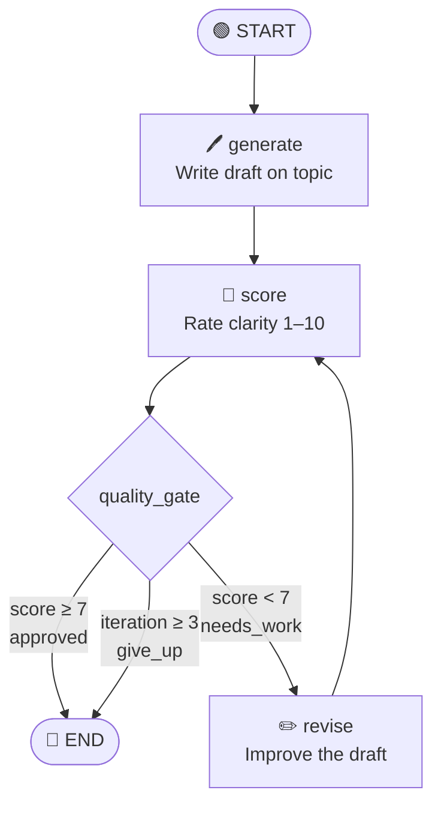
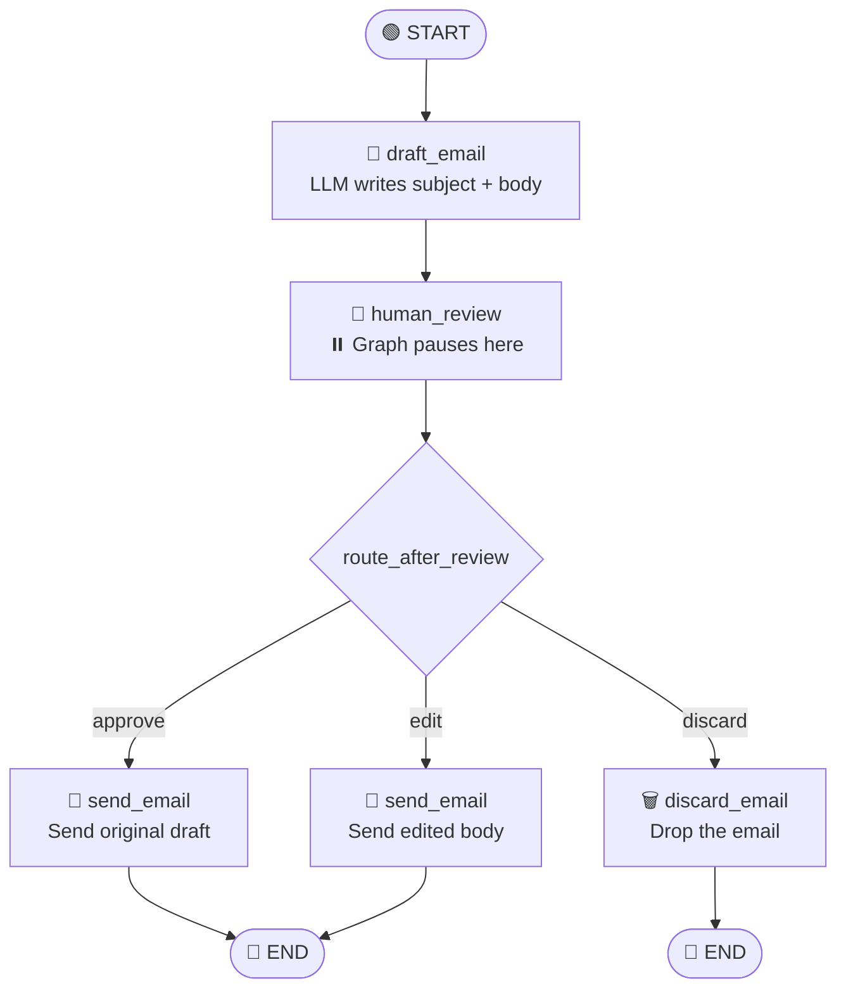

# agent-ai-langraph

Learning project exploring LangGraph concepts — from simple stateful graphs to human-in-the-loop agents — powered by Groq (Qwen3-32B) and traced via LangSmith.

---

## Prerequisites

- Python 3.13+
- [uv](https://docs.astral.sh/uv/) package manager
- A [Groq API key](https://console.groq.com)
- A [LangSmith API key](https://smith.langchain.com) (optional, for tracing)

---

## Setup

**1. Clone and install dependencies:**
```bash
uv sync
```

**2. Create a `.env` file in the project root:**
```env
GROQ_API_KEY=your_groq_api_key_here

# Optional — enables LangSmith tracing
LANGSMITH_API_KEY=your_langsmith_api_key_here
LANGCHAIN_TRACING_V2=true
LANGCHAIN_PROJECT=agent-ai-langraph
```

---

## Use Case 1 — Simple LangGraph: Draft → Score → Revise Loop

**Folder:** `01_simple_langraph/`

### What it does

Demonstrates a basic stateful graph with conditional edges:

1. **`generate`** — LLM writes a short paragraph on a given topic
2. **`score`** — LLM scores the draft for clarity (1–10)
3. **`revise`** — LLM improves a low-scoring draft
4. **`quality_gate`** — Conditional router:
   - Score ≥ 7 → `END` (approved)
   - Iteration ≥ 3 → `END` (give up)
   - Otherwise → loop back to `revise`

### Graph



> A `graph.png` file is also saved to `01_simple_langraph/` when the script runs.

### Run

```bash
cd 01_simple_langraph
uv run langraph_nodes.py
```

### Expected output

```
# Output
<final approved or revised paragraph about quantum computing>
```

---

## Use Case 2 — Human-in-the-Loop (HITL) Email Agent

**Folder:** `02_langraph_agent/`

### What it does

Demonstrates a graph that **pauses for human review** using LangGraph's `interrupt` + `Command(resume=...)` pattern:

1. **`draft_email`** — LLM generates an email subject and body from an instruction
2. **`human_review`** — Graph pauses; human inspects draft and provides a decision
3. **`route_after_review`** — Conditional router based on decision:
   - `approve` → `send_email`
   - `edit` → `send_email` (with overridden body)
   - `discard` → `discard_email`
4. **`send_email`** — Prints the final email
5. **`discard_email`** — Prints a discard message

> `MemorySaver` is required as the checkpointer — it freezes graph state at the interrupt point so it can be resumed.

### Graph



### Run

```bash
cd 02_langraph_agent
uv run agent.py
```

### Resuming the graph

After the graph pauses at `human_review`, resume it by passing a `Command`:

```python
# Approve as-is
graph.invoke(Command(resume={"decision": "approve"}), config=config)

# Edit the body then send
graph.invoke(
    Command(resume={
        "decision":    "edit",
        "edited_body": "Hi team,\nLaunching next Friday at 10am IST!\n— The Team",
    }),
    config=config,
)

# Discard
graph.invoke(Command(resume={"decision": "discard"}), config=config)
```

### Expected output

```
🤖 Drafting email...

⏸️  Graph paused at: ('human_review',)
==================================================
  SUBJECT : <LLM-generated subject>
  BODY    :
  <LLM-generated body>
==================================================

📧 EMAIL SENT
   Subject : <subject>
   Body    :
   <final body>
```

---

## Project Structure

```
agent-ai-langraph/
├── .env                        # API keys (not committed)
├── pyproject.toml
├── README.md
├── 01_simple_langraph/
│   ├── langraph_nodes.py       # Draft → Score → Revise loop
│   └── graph.png               # Auto-generated graph diagram
└── 02_langraph_agent/
    └── agent.py                # Human-in-the-loop email agent
```

---

## LangSmith Tracing

If `LANGCHAIN_TRACING_V2=true` is set in `.env`, all runs are automatically traced. View traces at [smith.langchain.com](https://smith.langchain.com) under the project **agent-ai-langraph**.
